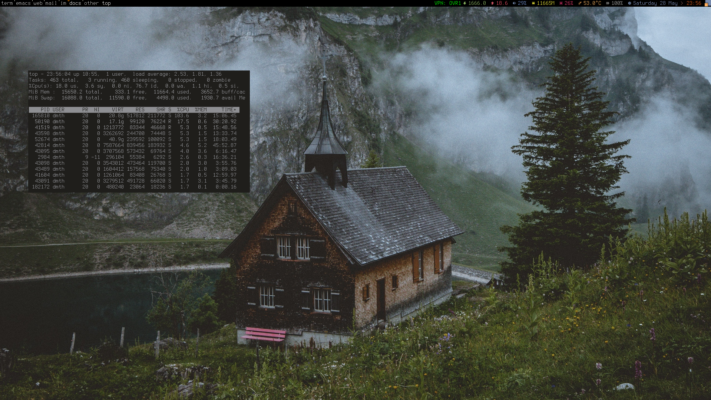

# OMTH's AwesomeWM configuration

## About

Configuration based on awesome-copycats multicolor theme

### Features

* CPU
* Memory 
* Battery
* Temperature
* Layout indicator
* VPN ON/OFF based on `ip` parsing
* Wallpaper included, something from wallheaven

#### Changes

* Removed bottom taskbar
* Removed window titlebar
* Add VPN indicator
* Change font to Terminus 12
* Add screenshot binding keys `Mod + Shift + r` with choosing screenshot area
* Change colors
* Change tag names

## How to install

* Put contents of this directory to your ~/.config/awesome

## Dependencies

All included inside, no submodules needed

